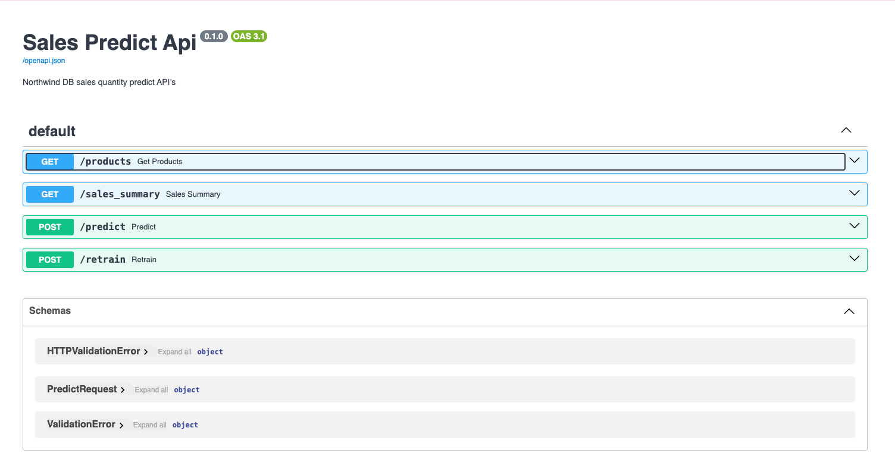
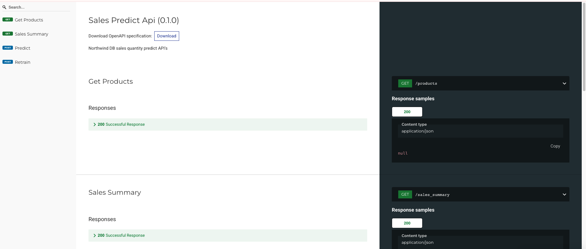

# Proje adı: sales-prediction-fastapi
Bu proje, Turkcell Geleceği Yazanlar Kadınlar programı kapsamında Pair 1 ekibi tarafından geliştirilmiştir.

Sunum Linki: https://www.canva.com/design/DAGjH_NoQjk/ujpHQ_SLg-opD1AighsxRA/edit?utm_content=DAGjH_NoQjk&utm_campaign=designshare&utm_medium=link2&utm_source=sharebutton

- Bilgesu Karakoç
- Yağmur Polat
- Sevgi Berk
- İlayda Arzu Akkuş
- Seda Mürütsoy
- Mehdiye Yıldız
- Ceren Şenkaya
- Esra Kaya

## Northwind Veri Tabanı Üzerinde Makine Öğrenmesi Projesi

- Bu projede Northwind veri tabanı üzerinde:

- Veri tabanına bağlanma ve verileri çekme
- Keşifsel veri analizi (EDA) ve veri ön işleme
- Satış tahminlemesi için üç farklı model karşılaştırması (Linear Regression, Decision Tree, Random Forest)
- En iyi performans gösteren modelin FastAPI ile servis edilmesi

gibi adımlar gerçekleştirilmiştir.

## Dosya Yapısı
    .
    ├── machine_learning/                # Makine öğrenmesi modelleri
    │   ├── decision_tree.py             # Karar ağacı modeli implementasyonu
    │   ├── linear_regression.py         # Linear regresyon modeli implementasyonu
    │   ├── random_forest.py             # Random forest modeli implementasyonu
    │   └── model_comparison.py          # Model karşılaştırması
    ├── northwind_data/                  # Northwind veri seti ve ilgili dosyalar
    ├── .env                             # Ortam değişkenleri (gitignore'da)
    ├── .gitignore                       # Git tarafından izlenmeyecek dosyaların listesi
    ├── database_connect.py              # Veritabanı bağlantı işlemleri
    ├── database_definition.py           # Veritabanı şema, veri hazırlama ve özellik mühendisliği
    ├── Dockerfile                       # Docker konteyner yapılandırması
    ├── docker-compose.yml               # Docker Compose konfigürasyonu
    ├── eda_utils.py                     # Keşifsel veri analizi için yardımcı fonksiyonlar
    ├── fast_api.py                      # FastAPI ile oluşturulmuş API servisleri
    ├── main_model.py                    # Ana model entegrasyonu (Linear Regression)
    ├── model.pkl                        # Eğitilmiş model dosyası
    ├── requirements.txt                 # Proje bağımlılıkları
    └── scaler.pkl                       # Veri normalizasyonu için ölçeklendirici


## Temel Gereksinimler
Projeyi çalıştırmak için aşağıdaki yazılımlara ihtiyacınız vardır:

- Python 3.8+: Tüm kodlar Python 3.8 veya üzeri sürümlerle uyumludur

- PostgreSQL: Northwind veritabanını host etmek için gereklidir

- pgAdmin: PostgreSQL veritabanını görsel arayüzle yönetmek için

- VS Code: Kod düzenleme ve geliştirme ortamı

- Docker ve Docker Compose: Projeyi konteynerize etmek için


## 1.Northwind Veritabanını İndirme ve Kurma

Northwind veritabanını PostgreSQL'e kurmak için aşağıdaki adımları takip edin:

1. Northwind veritabanı SQL dosyasını indirin:

GitHub'dan Northwind PostgreSQL SQL dosyasını indirin

2. PostgreSQL'de yeni bir veritabanı oluşturun:

   psql komut satırı aracıyla
   psql -U postgres -c "CREATE DATABASE northwind;"
   veya pgAdmin aracılığıyla yeni bir veritabanı oluşturun

 3. SQL dosyasını içe aktarın:
  
   psql ile SQL dosyasını yükleyin
   psql -U postgres -d northwind -f northwind.sql
   veya pgAdmin'de SQL editörünü kullanarak dosya içeriğini çalıştırın


4. Veritabanının doğru yüklendiğini kontrol edin

   Tabloları listeleyerek kontrol edin
   psql -U postgres -d northwind -c "\dt"
   veya pgAdmin'de northwind veritabanı altındaki tabloları görüntüleyin


## 2.Veri Hazırlama ve Özellik Mühendisliği
database_definition.py dosyası veritabanından çekilen verileri model için hazırlar:

- Temel verilerin birleştirilmesi (siparişler, sipariş detayları, ürünler)
- Toplam harcama sütunu oluşturulması
- Müşteri bazlı segmentasyon
- Ürün bazlı segmentasyon
- Ürün bazlı ortalama harcama hesaplanması
- Sipariş ayı bilgisinin çıkarılması
- Aylık bazda segmentasyon
- Stok ve yeniden sipariş seviyesi etkileşimi
- Kategori bazlı toplam satış ve sıralama
- İndirim bilgisinin binary olarak eklenmesi

## 3. Veri Analizi ve Ön İşleme
eda_utils.py dosyasında temel keşifsel veri analizi işlemleri gerçekleştirilmiştir:

- Eksik verilerin kontrolü
- Aykırı değerlerin IQR yöntemiyle tespiti
- Log dönüşümü ile çarpık dağılımların normalize edilmesi
- Müşteri, ürün ve zaman bazlı satış özetleri
- Müşteri segmentasyonu
- Korelasyon analizi

## 4.Makine Öğrenmesi Modelleri
machine_learning dosyasında projede 3 farklı regresyon modeli karşılaştırılmıştır:

- Linear Regression: Ölçeklendirilmiş veri üzerinde temel doğrusal regresyon
- Decision Tree: Max_depth parametresi ile sınırlandırılmış karar ağacı
- Random Forest: Topluluk öğrenmesi yaklaşımı

Performans karşılaştırması sonucunda Linear Regression modeli seçilmiş ve API servisinde kullanılmıştır.

Kullanılan özellikler:

- monthly_segment: Ay bazlı segment bilgisi
- product_segment: Ürün bazlı segment bilgisi
- product_mean_spent: Ürün bazlı ortalama harcama
- stock_reorder_interaction: Stok ve yeniden sipariş etkileşimi
- category_rank: Kategori sıralaması
- has_discount: İndirim olup olmaması (0/1) 


## 5. FastAPI 
fast_api.py dosyası ile model API servisi olarak sunulmuştur:

/products (GET): Ürün listesini döndürür
/sales_summary (GET): Satış özet verisini döndürür
/predict (POST): Yeni veriler için tahmin yapar
/retrain (POST): Modeli yeniden eğitir

   API servisini başlatmak için:
   python -m uvicorn fast_api:app --reload

## 6. Dökümantasyon

Dökümantasyona erişmek için:

Swagger UI: http://localhost:8000/docs
ReDoc: http://localhost:8000/redoc

-------------------------------------------------------------

## Kurulum ve Çalıştırma

Projeyi çalıştırmak için aşağıdaki gereksinimlere ihtiyacınız vardır:

1. Repository’yi klonla:
   ```bash
   git clone https://github.com/kullaniciAdi/northwind-sales-api.git
   cd northwind-sales-api


## 1.requirements.txt dosyasındaki bağımlılıkları yükleyin
   pip install -r requirements.txt

Temel gereksinimler şunlardır:

- Python 3.8+
- pandas
- numpy
- scikit-learn
- matplotlib
- seaborn
- sqlalchemy
- psycopg2
- fastapi
- uvicorn
- python-dotenv
- joblib

## 2.Ortam Değişkenleri (.env Dosyası)
.env dosyası PostgreSQL veritabanı bağlantı bilgilerini içerir ve proje kök dizinine yerleştirilmelidir. Güvenlik için .gitignore dosyasına eklenmiştir. Aşağıdaki formatta oluşturulmalıdır:

   DB_USER=kendi kullanıcı adınız
   DB_PASS=şifreniz
   DB_HOST=localhost
   DB_PORT=5432
   DB_NAME=northwind

Bu değişkenler, database_connect.py dosyasında şu şekilde kullanılır:

load_dotenv()

DB_USER = os.getenv("DB_USER")
DB_PASS = os.getenv("DB_PASS")
DB_HOST = os.getenv("DB_HOST")
DB_PORT = os.getenv("DB_PORT")
DB_NAME = os.getenv("DB_NAME")

DATABASE_URL = f"postgresql+psycopg2://{DB_USER}:{DB_PASS}@{DB_HOST}:{DB_PORT}/{DB_NAME}"

## 3. Northwind Veri Tabanı Kurulumu
Yukarıdaki "Northwind Veritabanını İndirme ve Kurma" bölümünde açıklandığı gibi veritabanını kurun, veya mevcut bir Northwind veritabanı kurulumunuz varsa, aşağıdaki adımları izleyin:

- Veritabanı bağlantı bilgilerini doğru şekilde .env dosyasında ayarlayın:
   DB_USER=kendi kullanıcı adınız
   DB_PASS=şifreniz
   DB_HOST=postgre
   DB_PORT=5432
   DB_NAME=northwind

- Veritabanı bağlantısını test edin:
   python -c "from database_connect import engine

## 4. Veri Analizi
Keşifsel veri analizi (EDA) yapmak için:   
Bu komut, veri dağılımlarını gösteren grafikler oluşturacak ve müşteri/ürün/ay bazlı satış özetlerini konsola yazdıracaktır.

## 5. Model Eğitimi
- Tüm modelleri karşılaştırmak için machine_learnng dosyasındaki dosyaları çalıştırın ve sonuçları görün.
- Ana modeli (Linear Regression) eğitmek için: python main_model.py
- Bu komut, modeli eğitip model.pkl ve scaler.pkl dosyalarını kaydedecektir.

## 6. API Servisini Başlatma
python -m uvicorn fast_api:app --reload
- Bu komut API servisini başlatır ve değişiklikler yapıldığında otomatik olarak yeniden yükler.


## Docker ile Çalıştırma
Projeyi tek başına Docker konteynerinde çalıştırmak için:

- Docker imajını oluşturun
docker build -t northwind-ml-project .

- Konteyner'ı çalıştırın
docker run -p 8000:8000 northwind-ml-project

Uygulamayı ve PostgreSQL veritabanını birlikte Docker Compose ile çalıştırmak için:

- Servisleri başlatın
docker-compose up -d

- Logları izleyin
docker-compose logs -f

Not: Docker Compose kullanırken veritabanı adresini localhost yerine container adı olan postgres olarak ayarlamanız gerekir. Docker Compose bu ayarı otomatik olarak yapar ve .env dosyasındaki diğer değerleri (kullanıcı adı, şifre, port, veritabanı adı) kullanır.

## API Arayüzü
API'nin Swagger arayüzü, tüm endpointleri ve kullanımlarını dökümante eder. Uygulamayı çalıştırdıktan sonra tarayıcınızdan http://localhost:8000/docs adresine giderek bu arayüze erişebilirsiniz.





## API Kullanımı Örnekleri
- Ürün Listesi Almak : 
curl -X 'GET' 'http://localhost:8000/products'

- Satış Özeti Almak 
curl -X 'GET' 'http://localhost:8000/sales_summary'

- Tahmin Yapmak: 

curl -X 'POST' 'http://localhost:8000/predict' \
-H 'Content-Type: application/json' \
-d '{
  "product_id": 11,
  "customer_id": "ALFKI",
  "order_date": "15/03/1997"
}'

- Modeli Yeniden Eğitmek

curl -X 'POST' 'http://localhost:8000/retrain'

## Modellerin Değerlendirilmesi
Model performansları aşağıdaki metrikler kullanılarak değerlendirilmiştir:

R² skoru: Model tarafından açıklanan varyans oranı
RMSE (Root Mean Squared Error): Tahmin hatalarının karekökü
Cross-Validation: 5-fold cross validation ile model genelleştirme yeteneği

Karşılaştırma sonucunda Linear Regression modeli, yeterli performans ve basitlik sağlaması nedeniyle tercih edilmiştir.

----------------------------------------------------

## API Veri Tipleri

Northwind Veritabanı Tabloları ve Anahtar Alanlar

- orders: order_id (PK), customer_id (FK), order_date
- order_details: order_id (FK), product_id (FK), unit_price, quantity, discount
- products: product_id (PK), category_id (FK), units_in_stock, reorder_level
- customers: customer_id (PK)
- categories: category_id (PK)


Model Değişkenleri ve Veri Tipleri

- monthly_segment: integer - Ay bazlı segment bilgisi (1-12 arası)
- product_segment: integer - Ürün bazlı segment bilgisi (1-77 arası)
- product_mean_spent: float - Ürün bazlı ortalama harcama
- stock_reorder_interaction: integer - Stok ve yeniden sipariş etkileşimi
- category_rank: integer - Kategori sıralaması
- has_discount: integer - İndirim olup olmaması (0/1)


POST /predict Endpoint'i
Request Body:
```json
{
  "product_id": integer,  // Ürün ID'si
  "customer_id": string,  // Müşteri ID'si (örn. "ALFKI")
  "order_date": string    // Sipariş tarihi (format: "DD/MM/YYYY")
}

{
  "prediction": float  // Tahmin edilen miktar
}


